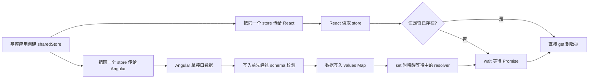

# shared-service

一个给 Angular / React 微前端共用的共享内存方案。

## 这东西到底干嘛的

它解决的是这个问题：

- Angular 主应用先拿到接口数据
- React 子应用也想马上用这份数据
- 但又不想把数据挂到 `window` 上
- 还希望这份数据只在当前基座运行期间有效

所以我们让**基座应用**创建一个共享 `store`，再把同一个 `store` 实例传给 Angular 和 React 子应用。

大家拿到的是**同一份对象引用**，所以谁写进去，谁都能读到。

---

## 核心原理

重点就一句话：

> **基座创建共享 store，然后把同一个 store 实例注入给所有子应用。**

这不是全局变量，也不是挂到 `window`。  
它只是一个普通的 JavaScript 对象，但因为传的是同一个引用，所以大家操作的是同一份内存。

### 为什么能共享

JavaScript 的对象是按引用传递的。

比如：

```ts
const store = createSharedMemoryStore();
const angularStore = store;
const reactStore = store;
```

这三个变量指向的是同一个对象。

所以：

- Angular `set` 一次
- React 再 `get`
- 拿到的就是同一份数据

---

## 类型和 schema

这套方案里，**类型和运行时校验是一体的**。

我们在 `shared-contract.ts` 里只维护一份共享契约：

- `sharedSchemas`：运行时 schema
- `SharedDataMap`：从 schema 自动推导出来的 TS 类型

也就是说：

- 基座和子应用都依赖同一份契约
- 数据写入时会做 schema 校验
- 读取时有完整的类型提示
- 类型变了，只改一处

### 例子

```ts
export const sharedSchemas = {
  userInfo: z.object({
    id: z.number(),
    name: z.string(),
  }),
  token: z.string(),
} as const;

export type SharedDataMap = {
  [K in keyof typeof sharedSchemas]: z.infer<(typeof sharedSchemas)[K]>;
};
```

---

## 工作流程图



---

## 文件

- `shared-contract.ts`：共享类型契约 + schema
- `shared-memory.service.ts`：Angular 侧服务
- `react-usage-example.tsx`：React 侧示例

---

## Angular 侧怎么用

基座先创建共享 store：

```ts
const store = createSharedMemoryStore();
```

然后在 Angular 里把它注入进去：

```ts
providers: [
  { provide: SHARED_MEMORY_STORE, useValue: store }
]
```

在服务里直接使用：

```ts
constructor(private sharedMemory: SharedMemoryService) {}

async loadUser() {
  await this.sharedMemory.ensure('userInfo', fetch('/api/user').then(res => res.json()));
}

const user = this.sharedMemory.get('userInfo');
```

---

## React 侧怎么用

React 子应用拿到同一个 store 后，直接读：

```tsx
import {
  createSharedMemoryStore,
  setSharedData,
  getSharedData,
  waitSharedData,
} from './react-usage-example';

const store = createSharedMemoryStore();
setSharedData(store, 'userInfo', { id: 1, name: 'Tom' });
const user = getSharedData(store, 'userInfo');
```

如果数据还没回来：

```tsx
waitSharedData(store, 'userInfo').then((data) => {
  console.log(data);
});
```

---

## 这套方案的优点

- 不污染 `window`
- 更适合微前端基座控制
- 子应用之间共享同一个内存对象
- `Promise` 可以配合等待机制，避免重复请求
- 有 schema 校验，避免脏数据直接进入共享 store
- 类型从 schema 自动推导，不用维护两套

---

## 注意

- 这套方案依赖基座把**同一个 store 实例**传给所有子应用
- 只要基座还在，这份内存就还在
- 刷新页面后，store 需要由基座重新创建并重新注入
- 它是运行时共享，不是持久化存储

---

## 关键理解

如果你把它想成一个“共享冰箱”，那就很好懂：

- 基座 = 房东
- store = 冰箱
- Angular / React = 住户
- 住户不是各自买冰箱，而是都用房东提供的同一个冰箱

谁先把东西放进去，别人就能拿到。
