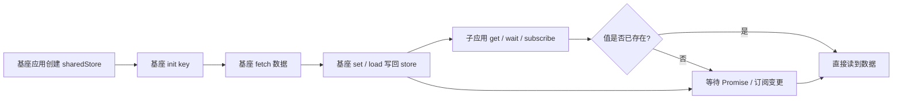

# shared-service

一个给 Angular / React 微前端共用的共享内存方案。

## 这东西到底干嘛的

它解决的是这个问题：

- Angular 主应用先拿到接口数据
- React 子应用也想马上用这份数据
- 但又不想把数据挂到 `window` 上
- 还希望这份数据只在当前基座运行期间有效
- 有些共享对象一开始还没数据，得先占位，后面子项目再把数据补上
- 其他人还要能知道它现在是 loading 还是 error，不能瞎猜

所以现在这套会更明确一点：

- **基座负责写**：准备 init / fetch / set / error / clear
- **子应用负责读**：只管 `get / wait / subscribe`
- 子应用不要自己发起“谁先写谁后写”的竞赛
- 真正的数据入口，应该收敛在基座那边

这就比较像“基座发货，子应用收货”。

---

## 核心原理

重点就一句话：

> **基座创建共享 store，然后把同一个 store 实例注入给所有子应用。**

这不是全局变量，也不是挂到 `window`。  
它只是一个普通的 JavaScript 对象，但因为传的是同一个引用，所以大家操作的是同一份内存。

### 为什么能共享

JavaScript 的对象是按引用传递的。

比如：

```ts
const store = createSharedMemoryStore();
const angularStore = store;
const reactStore = store;
```

这三个变量指向的是同一个对象。

所以：

- 基座 `set` 一次
- 子应用再 `get`
- 拿到的就是同一份数据

---

## 新的分工

### 基座侧

基座负责：

- `init(key)`：先把这个 key 标成 loading，告诉外界“这个东西正在准备”
- `load(key, source)`：自己发起请求，回写到共享对象
- `set(key, value)`：直接塞值
- `setError(key, error)`：把错误也挂上去
- `remove / clear`：终止当前 key 的所有等待

### 子应用侧

子应用只做这些：

- `get(key)`：读当前值
- `wait(key)`：等值准备好
- `subscribe(key)`：看变化

子应用不要去抢“这个对象到底谁来 fetch”。那是基座的活。

---

## 新增能力

这版补了几件事：

- `loading / error / ready / idle` 状态
- `wait(..., { timeoutMs })` 超时等待
- `subscribe(...)` 订阅变更
- `init(...)` 先挂对象
- `load(...) / set(...)` 由基座写入
- `remove / clear` 会主动终止等待中的 promise，不会把人晾成 pending
- 首次订阅会发 `init` 事件，里面带当前快照
- `updatedAt` 会稳定保存在 store 里，不会每次读都变
- 异步写入会用 epoch 防串台，`wait` 和 `load` 不会互相把状态搞乱

这就比较像“共享一个对象壳子”，壳子先放出去，数据之后慢慢挂上来。

---

## 类型和 schema

这套方案里，**类型和运行时校验是一体的**。

我们在 `shared-contract.ts` 里只维护一份共享契约：

- `sharedSchemas`：运行时 schema
- `SharedDataMap`：从 schema 自动推导出来的 TS 类型

也就是说：

- 基座和子应用都依赖同一份契约
- 数据写入时会做 schema 校验
- 读取时有完整的类型提示
- 类型变了，只改一处

### 例子

```ts
export const sharedSchemas = {
  userInfo: z.object({
    id: z.number(),
    name: z.string(),
  }),
  token: z.string(),
} as const;

export type SharedDataMap = {
  [K in keyof typeof sharedSchemas]: z.infer<(typeof sharedSchemas)[K]>;
};
```

---

## 工作流程图



---

## 文件

- `shared-contract.ts`：共享类型契约 + schema
- `shared-memory.service.ts`：Angular 侧服务
- `react-usage-example.tsx`：React 侧示例

---

## Angular 侧怎么用

基座先创建共享 store：

```ts
const store = createSharedMemoryStore();
const reader = sharedMemory.reader(store);
const writer = sharedMemory.writer(store);

writer.init('userInfo');
writer.load('userInfo', fetch('/api/user').then(res => res.json()));
```

子应用只读：

```ts
const user = reader.get('userInfo');
const ready = await reader.wait('userInfo', { timeoutMs: 3000 });
reader.subscribe('userInfo', (event) => {
  console.log(event.action, event.status, event.value, event.error);
});
```

---

## React 侧怎么用

React 子应用拿到同一个 store 后，直接读：

```tsx
const store = createSharedMemoryStore();
const reader = createSharedReader(store);
const writer = createSharedWriter(store);

writer.init('userInfo');
writer.load('userInfo', fetch('/api/user').then(res => res.json()));

const user = reader.get('userInfo');
```

如果数据还没回来：

```tsx
reader.wait('userInfo', { timeoutMs: 3000 })
  .then((data) => {
    console.log(data);
  })
  .catch((err) => {
    console.error('wait timeout or error', err);
  });

reader.subscribe('userInfo', (event) => {
  console.log(event.action, event.status, event.value, event.error);
});
```

---

## 这套方案的优点

- 不污染 `window`
- 更适合微前端基座控制
- 子应用之间共享同一个内存对象
- `Promise` 可以配合等待机制，避免重复请求
- 有 schema 校验，避免脏数据直接进入共享 store
- 类型从 schema 自动推导，不用维护两套
- 有 loading / error / ready 状态，UI 能直接接住
- 支持订阅变更，后续挂载数据很顺手
- remove / clear 不会留悬空等待
- 责任边界更清楚：基座写，子应用读

---

## 注意

- 这套方案依赖基座把**同一个 store 实例**传给所有子应用
- 只要基座还在，这份内存就还在
- 刷新页面后，store 需要由基座重新创建并重新注入
- 它是运行时共享，不是持久化存储
- `wait` 可以超时，但它不是消息队列；更适合“等对象就绪”
- 如果多个子应用都去写同一个 key，设计上就会乱，别这么玩

---

## 关键理解

如果你把它想成一个“共享冰箱”，那就很好懂：

- 基座 = 房东
- store = 冰箱
- 子应用 = 住户
- 房东负责买菜、放菜、贴标签
- 住户只管打开冰箱拿东西，或者等冰箱补货

谁来做供给，谁来做消费，这个边界要清楚，不然以后肯定乱。
